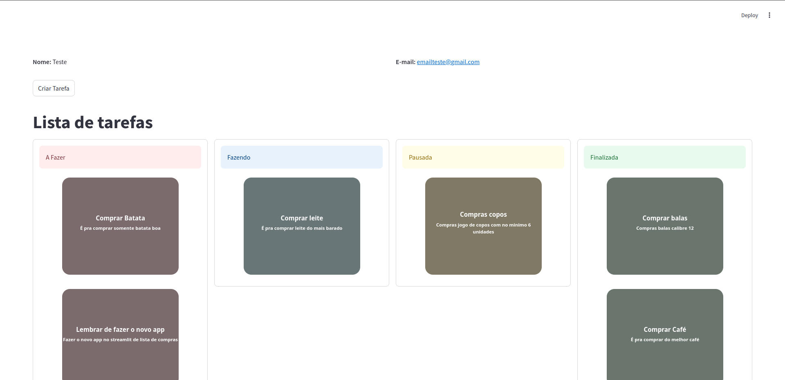
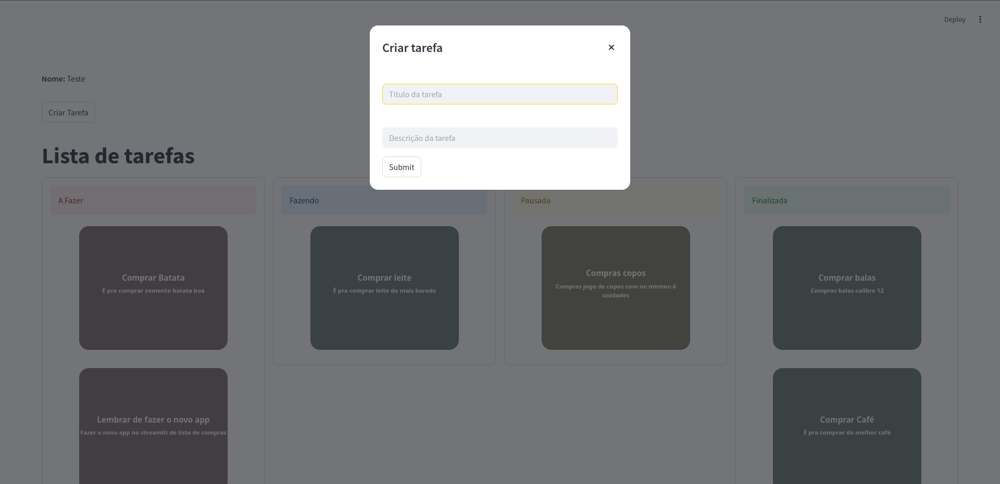

# TO DO LIST 🛡️📝

Este é um projeto de lista de tarefas desenvolvido com [Streamlit](https://streamlit.io/), [Poetry](https://python-poetry.org/) para gerenciamento de dependências e ambiente virtual, e [SQLite](https://www.sqlite.org/index.html) com [SQLAlchemy](https://www.sqlalchemy.org/) para persistência de dados.

---

## 🚀 Como executar o projeto

### 1. Instalar o `pipx` (caso ainda não tenha)

```bash
pip install pipx
```

### 2. Instalar o Poetry usando `pipx`

```bash
pipx install poetry
```

### 3. Clonar este repositório

Escolha uma das opções abaixo:

* Via HTTPS:

```bash
git clone https://github.com/IsaiasFMAlcantara/todo_list.git
```

* Via SSH:

```bash
git clone git@github.com:IsaiasFMAlcantara/todo_list.git
```

### 4. Acessar o diretório do projeto

```bash
cd todo_list
```

### 5. Criar o arquivo de configuração `secrets.toml`

Antes de rodar o projeto, você precisa criar um arquivo chamado `secrets.toml` dentro do diretório `.streamlit` com o seguinte conteúdo:

```toml
# .streamlit/secrets.toml

database_url = "sqlite:///./NOME_DO_TEU_BANCO.db"
encode = "teu_encript_code"  # este valor será usado como 'salt' ou chave base para codificação com bcrypt
```

> ℹ️ **Observação:**
> A variável `encode` é utilizada para codificação com **bcrypt**.
> Caso não esteja familiarizado, vale a pena pesquisar sobre [bcrypt](https://en.wikipedia.org/wiki/Bcrypt) e como ele utiliza um *salt* para garantir segurança na encriptação de dados sensíveis.

Substitua:

* `NOME_DO_TEU_BANCO.db` pelo nome desejado para o seu banco SQLite.
* `teu_encript_code` por uma chave segura, preferencialmente uma string aleatória e forte.

> 💡 Certifique-se de que a pasta `.streamlit` exista. Se não existir, crie-a:
>
> ```bash
> mkdir .streamlit
> ```

### 6. Instalar as dependências do projeto

```bash
poetry install
```

### 7. Ativar o ambiente virtual

* Em sistemas Unix/macOS:

```bash
eval "$(poetry env info --path)/bin/activate"
```

* Em Windows:

```powershell
poetry shell
```

### 8. Executar o projeto

```bash
task run
```

---

## 🧰 Tecnologias Utilizadas

* [Python](https://www.python.org/)
* [Streamlit](https://streamlit.io/)
* [Poetry](https://python-poetry.org/)
* [SQLite](https://www.sqlite.org/)
* [SQLAlchemy](https://www.sqlalchemy.org/)
* [Taskfile](https://taskfile.dev/) (para automatização de comandos)

### 9. Imagens
---
- Imagem do login

---
- Imagem da página de todo

---
- Imagem da página de criar tarefa

